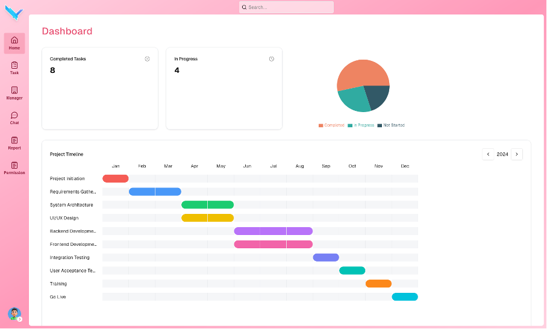

# Company Task Manager App

## Overview

The **Company Task Manager** is a comprehensive task management system designed to help employees manage both **personal tasks** and **department-specific tasks** in a company setting. The application allows users to create, assign, prioritize, and track tasks across departments, improving collaboration and overall productivity. It provides users with an organized way to handle their personal tasks and also keep track of team or department tasks, deadlines, and progress.

This app is built to be scalable, providing functionality for managing tasks across departments while also keeping track of individual responsibilities.

---

## Features

- **Kanban Board**: List task with kanban board view
- **Personal Tasks**: Manage individual tasks and track personal progress.
- **Department Tasks**: Create and assign tasks to departments, set deadlines, and track team progress.
- **Task Assignment**: Assign tasks to specific employees within a department, or allow users to manage their personal tasks.
- **Task Prioritization**: Set priority levels for tasks (e.g., High, Medium, Low) to help prioritize work.
- **Due Dates**: Set deadlines for each task and receive reminders (if applicable).
- **Status Tracking**: Mark tasks as Pending, In Progress, or Completed to track progress.
- **Team Collaboration**: Comment on tasks, upload files, and collaborate with teammates on department tasks.
- **Search & Filter**: Quickly search and filter tasks by category, status, or due date.
- **Admin Panel** (Optional): For admins to manage users, departments, and task assignments.

---

## Tech Stack

- **Frontend**:

  - **NextJS** for building website

- **Backend**:

  - **ASP.Net** for building Restful API
  - Postgres database for storing tasks, users, and department information.

- **Additional Libraries/Frameworks**:

  - **Supabase**: Service provide Multi-method authentication like JWT-based Authentication for user login (if applicable), provide a lot of services to control database: sql to Restful API (PostgRest), realtime database,...
  - **SWR** for interact with client fetch data, cache api,...
  - **Shadcn UI**: easy UI development

---

## Installation

### For backend installation please follow this [Backend Repository](https://github.com/daklod2k3/task-manager-be)

### 1. Clone the Repository

Clone the repository to your local machine:

```bash
git clone https://github.com/daklod2k3/task-manager-be
cd task-manager-be
```

### 2. Install Dependencies

```bash
yarn install
```

### 3. Set Up the Backend API

Add environment variable in .env:

- NEXT_PUBLIC_SUPABASE_URL: your supabase project url
- NEXT_PUBLIC_SUPABASE_ANON_KEY: your supabase project anon key
- SUPABASE_KEY: your supabase project secret key (for create user permission)

### 4. Run the App

```bash
### for development
yarn dev

#### for production run
yarn build
yarn start
```

The app should now be running locally, typically at `http://localhost:3000`

---

## Usage

### 1. **Creating a Task**

- **Personal Task**: Create tasks for yourself by selecting the "Task" category and adding a title, description, priority, and due date.
- **Department Task**: Select the "Department" category, choose the relevant department, assign the task to specific employees, and set a due date.

### 2. **Assigning Tasks**

- Assign a task to specific employees in the department or mark a task as personal.
- Add detailed descriptions and attach relevant files (e.g., PDFs, images).

### 3. **Task Prioritization**

- When creating or editing a task, set its priority to **High**, **Medium**, or **Low**.

### 4. **Task Status**

- Update the status of tasks (Pending, In Progress, Completed) to track your progress or your team's progress.
- Completed tasks can be archived or deleted based on your preference.

### 5. **Searching and Filtering**

- Use the search bar to find tasks by title, description, or employee.
- Filter tasks by department, priority, or completion status.

### 6. **Collaborating**

- Add comments and upload files for better collaboration with team members on department tasks.

---

## Admin Features

If you're an admin, you can:

- Add and manage employees.
- Create and manage departments.
- View reports on task completion across departments.
- Assign and reassign tasks to users as needed.

---

## TODO

- [x] Implement user authentication (Login/Signup).
- [ ] Implement notifications (email or in-app) for upcoming tasks and deadlines.
- [ ] Add real-time updates notification for task status (using Socket.io or similar).
- [ ] Integrate task analytics to track team productivity.
- [x] Allow multiple departments to have shared tasks.
- [ ] Optimize department UI/UX
- [ ] Add for complex task filter

---

## Screenshots

Here are some screenshots of the app in action:

_Login_


_Dashboard_


_Personal task list_

_Task detail_

_Chat_


---

## Feedback

If you encounter any bugs or have feature suggestions, please open an issue! We appreciate any feedback that helps us improve this app.

---

Let me know if you need any further adjustments!
